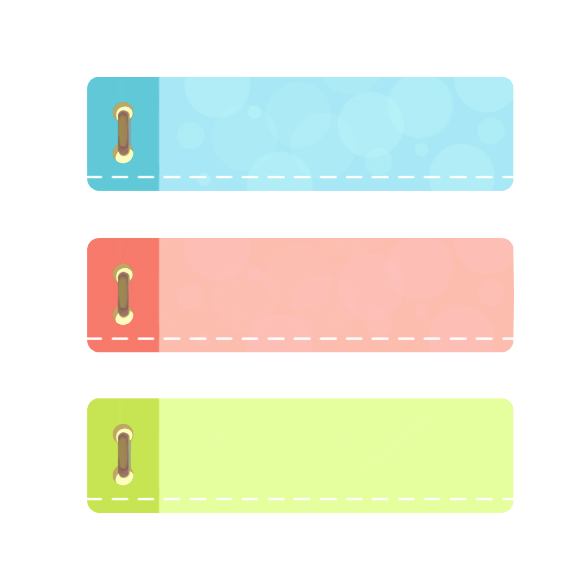

# YouTube Bookmarks Extension



**YouTube Bookmarks Extension** is a Chrome extension that allows users to save timestamps as bookmarks while watching YouTube videos. It provides an easy way to revisit specific moments in a video without having to manually remember or search for them.

## Table of Contents
- [Demo](#demo)
- [Features](#features)
- [Technologies Used](#technologies-used)
- [Installation](#installation)
- [Screenshots](#screenshots)
- [Usage](#usage)
- [Contributing](#contributing)
- [License](#license)

## Demo
👉🏻 [Click Me For Live Demo](https://drive.google.com/file/d/1PDAMzIh1VBh7nO3ezObSqJKojPEAm_au/view)

## Features

- **Bookmark Creation:** Click the bookmark button to save the current timestamp along with a brief description and keypoint.
- **Bookmark Listing:** View all bookmarks for the current video in the extension popup.
- **Play from Bookmark:** Click on a bookmark to jump to that timestamp in the video.
- **Bookmark Deletion:** Remove unwanted bookmarks from the list.

## Technologies Used

- **JavaScript (ES6+):** The primary programming language for building the extension.
- **HTML/CSS:** Used for creating the extension popup UI.
- **Chrome Extension APIs:** Leveraged the `chrome.tabs`, `chrome.storage`, and other APIs for extension functionality.
- **Manifest Version 3:** The extension manifest file is in version 3 format.
- **Git and GitHub:** Version control and collaboration\
  

## Installation

1. Download the extension folder or clone the repository:
   ```bash
   git clone https://github.com/Mayankkatheriya/Mct_4.git
2. Open Chrome and navigate to chrome://extensions/.
3. Enable "Developer mode" in the top right corner.
4. Click on "Load unpacked" and select the downloaded extension folder.

## Usage
1. Open any YouTube video.
2. Click on the bookmark button in the video player controls to add a new bookmark at the current timestamp.
3. Open the extension popup to view, play, or delete bookmarks.

## Screenshots
**Popup** \


## Contributing
**Contributions** are welcome! To contribute to the development of the YouTube Bookmarks Extension, follow these guidelines:

If you'd like to contribute to this project, please follow these guidelines:
1. Fork the project.
2. Create your feature branch: `git checkout -b feature/your-feature`
3. Commit your changes: `git commit -m 'Add some feature'`
4. Push to the branch: `git push origin feature/your-feature`
5. Open a pull request.

## Code Style
Follow the existing code style and structure. Ensure your code is well-documented and easy to understand.

## Issues
If you find any issues or have suggestions, feel free to open an issue and provide details.

## License
This project is currently not licensed. Feel free to add a license file (e.g., MIT License) if you wish to specify the terms under which others can use, modify, and distribute your code.

## Acknowledgments
Thanks to Mayank Gupta for creating and maintaining this extension.
